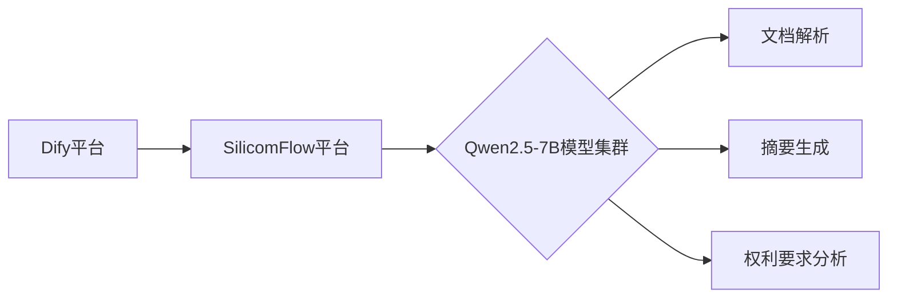

# 📄PatentDigest⚡

**基于Dify的专利文档智能解析工作流**  

## 🤔技术背景

专利文件都有着高度一致的格式要求和明确的结构标识（如内容顺序、权利要求书/说明书格式、说明书中每-段都有段落序号等），大幅降低了 LLM训练、微调、运用的技术门槛。

因此，理论上来说，「自动化处理专利文件」是LLM最容易落地的场景，这也是知识产权领域平台AI功能效果普遍比较好的一大原因。

## ⚡实施效果

自动提取专利文件关键信息，生成结构化摘要与权利要求分析，帮助快速掌握技术方案。

可按照特定的格式输出专利文件的基本信息，生成权利要求书和说明书摘要，快速了解全文内容。

将结构和 LLM提示词微调一下，也可以处理论文、合同等高度结构化的文本。

## ✨ 核心功能
- 📌 **一键解析**：支持PDF/DOCX等格式专利文档
- 🧠 **多模块协同**： 
  - 基本信息提取（名称/申请号/日期）
  - 摘要精炼（300字内关键摘要）
  - 权利要求书结构化分析
  - 创新点与技术方案提取
- 📊 **结构化输出**：标准化Markdown报告模板
- 🔧 **可扩展架构**：模块化LLM节点设计，支持自定义处理流程

## 🛠️ 技术栈

目前LLM用的是免费的qwen2.5-7b，粗糙地调试了一下流程，还有很多可以优化的地方。

大家正式用的时候可以用更好的LLM处理（如Qwen3、QWQ-32b或者deepseek-r1）。
